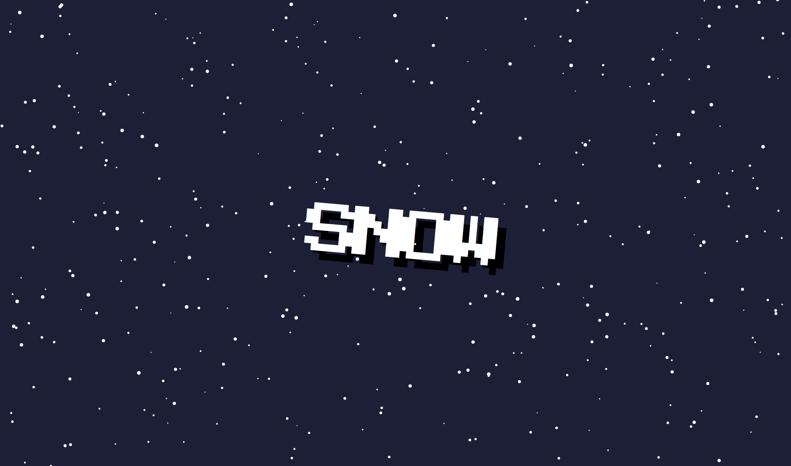

# SnowJS


SnowJS will help you use the beautiful snowing effect very simply!

## Preview



## Get Started

```html
<div class="snow-area"></div>

<script src="pkg"></script>
<script>
  const snowjs = new SnowJS({
    el: ".snow-area",
  });
  snowjs.start();
</script>
```

## Config Props

| Name          | Type     | Description                                             | Required | Default    |
| ------------- | -------- | ------------------------------------------------------- | -------- | ---------- |
| `el`          | `String` | Snowy effect area by qureySelector                      | Yes      |            |
| `frequency`   | `Number` | How often snowflake elements are added to the area      | No       | `20`ms     |
| `speedRange`  | `Array`  | Set speed range of snowflakes                           | No       | `[0.5, 3]` |
| `radiusRange` | `Array`  | Set radius range of snowflakes                          | No       | `[0.5, 3]` |
| `angle`       | `Number` | Angle at which the snowflake tilts (-1 ~ 1 recommended) | No       | `0`        |
| `colors`      | `Array`  | Color palette array for snowflake                       | No       | `["#FFF"]` |

## Future Updates

- Add config props `image` to custom snowflake image
- Add event hooks
- NPM package register
